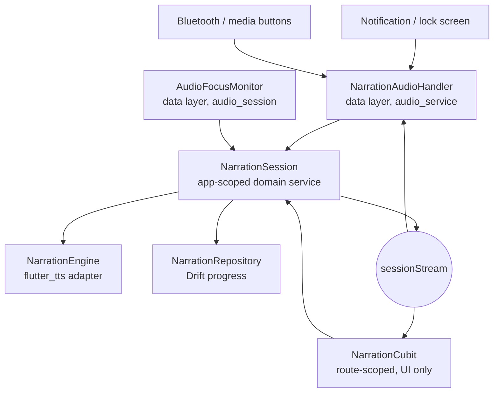

# Background Narration Design

**Spec**: `.specs/features/background_narration/spec.md`
**Context**: `.specs/features/background_narration/context.md`
**Status**: Approved — approach A confirmed 2026-08-26

---

## Research Findings

Knowledge Verification Chain: codebase → project docs → Context7 (**not available
in this environment**) → web search. Findings and their confidence:

| Finding | Confidence | Source |
| --- | --- | --- |
| `audio_service` 0.18.19 (published ~2026-06) documents the text-to-speech reader case and names `flutter_tts` as the way to render speech inside the handler | Verified | pub.dev package page |
| `AudioService.androidForceEnableMediaButtons()` exists in the current API: "forces media button events to be routed to your active media session" | Verified | audio_service API docs |
| `audio_service` does **not** handle audio focus or becoming-noisy; it delegates to `audio_session` (`interruptionEventStream`, `becomingNoisyEventStream`) | Verified | pub.dev package page |
| Required manifest entries: `WAKE_LOCK`, `FOREGROUND_SERVICE`, `FOREGROUND_SERVICE_MEDIA_PLAYBACK` (SDK 34+), a service with `android:foregroundServiceType="mediaPlayback"`, and a `MediaButtonReceiver` | Verified | pub.dev package page |
| `audio_service 0.18.19` + `audio_session 0.2.4` resolve cleanly against this project's SDK `^3.12.0` and `flutter_tts 4.2.5` | Verified | `flutter pub add --dry-run` |
| `flutter_tts` 4.2.5 **keeps speaking** after the activity is destroyed, under `audio_service`'s foreground service (BGN-01 AC3) | **Measured** | T2 spike, 2026-08-28. `RecentsContainer: removeTask` for `com.example.vox_novel/.MainActivity` at `20:01:12.714`; speech continued through four more paragraphs (`spoke n=6` … `speak n=10`) until `20:01:31.855`, ending only when the user pressed pause. The process kept its pid throughout. |
| Media button events reach the session **only** with `AudioService.androidForceEnableMediaButtons()` | **Measured** | T2 spike, 2026-08-28. Without the call, `cmd media_session dispatch pause` and `dispatch play-pause` both returned success and never reached the handler while the session was listed and playing. With the call, the same dispatch produced `SPIKE cmd=pause`. The call is required, not optional. |
| `androidNotificationOngoing: true` requires `androidStopForegroundOnPause: true` | **Measured** | The package asserts `!androidNotificationOngoing \|\| androidStopForegroundOnPause` (`audio_service.dart:3525`); the build fails otherwise. The spec's "dismissible only while paused" assumption is therefore a platform/library constraint, not a product choice. |
| Pausing drops the service's foreground state while the media session itself survives | **Measured** | T2 spike. Immediately after a pause, `cmd media_session list-sessions` still listed the app while `dumpsys activity services` no longer reported `isForeground=true`. After several minutes paused, an earlier observation found the session list empty. |

**Spike environment**: Xiaomi `2210129SG` (`ziyi_global`), Android 15, SDK 35, on
commit `873fbda`. MIUI blocked `adb install` until "Install via USB" was enabled
and blocks input injection entirely, so the two taps were performed by hand.

TTS produces no audio stream Android recognises as playback, and the spike
confirmed the consequence: media buttons are dropped until
`androidForceEnableMediaButtons()` is called. Phase 3 must call it during
initialisation, and an assertion should protect it — removing that one line
silently breaks every external control while leaving the notification intact.

---

## Architecture Overview

Playback ownership moves out of the route-scoped Cubit into an
application-scoped session. The audio handler and the UI both drive that one
session, so every surface reads and writes the same state — which is what
BGN-06 requires.



The session is the single source of truth. The handler translates platform
commands into session calls and mirrors `sessionStream` into the media
notification; the Cubit translates UI intent into the same session calls and
mirrors the same stream into `NarrationState`. Neither owns the engine.

---

## Code Reuse Analysis

### Existing components to leverage

| Component | Location | How to use |
| --- | --- | --- |
| `NarrationEngine` | `lib/features/narration/domain/services/narration_engine.dart` | Unchanged. AD-008 put the engine behind this adapter precisely so ownership could move; the session takes it over from the Cubit. |
| `NarrationQueue` | `.../domain/services/narration_queue.dart` | Unchanged. Moves from the Cubit into the session as-is, including its `awaitsDownload` download-boundary flag. |
| `NarrationRepository` | `.../domain/repositories/narration_repository.dart` | Unchanged. The session writes progress through it exactly as the Cubit does today. |
| `NarrationSettingsResolver` | `.../domain/services/narration_settings_resolver.dart` | Unchanged — global vs per-book settings resolution is orthogonal to where playback runs. |
| Playback logic in `NarrationCubit` | `.../presentation/cubit/narration_cubit.dart` (565 lines) | **Extracted**, not rewritten: queue advance, generation counters, voice repair, speech-failure handling, download-boundary reload, and progress persistence move into the session with their behaviour intact. |
| `NarrationCubitRegistry` | `lib/app/dependency_injection/configure_dependencies.dart` | Reduced to an attach point. Its whole purpose was guaranteeing a single foreground owner across routes; an app-scoped session guarantees that structurally. |
| Guarded DI registration + injection seams | `configure_dependencies.dart` | Same pattern for the session, the handler, and the focus monitor, so tests substitute fakes without touching platform code. |
| Architecture scan pattern | `test/architecture/web_source_architecture_test.dart` | Same import-scanning shape used for AD-010 confines `audio_service` to the data layer. |

### Integration points

| System | Integration |
| --- | --- |
| Reader (`ReaderPage`, `ReaderNarrationHost`) | Keeps its Cubit; the lifecycle pause at `reader_narration_host.dart:63` is removed so backgrounding no longer stops speech. |
| Web download boundary | Untouched. `NarrationQueue.awaitsDownload` and the single-reload-at-boundary behaviour move with the queue. |
| Visual reader position | Untouched on disk (AD-007). On attach the reader *shows* the narrated block without persisting a new visual position. |

---

## Components

### NarrationSession

- **Purpose**: Own narration playback for the whole application — one queue, one engine, one progress writer — regardless of which surface issued the command.
- **Location**: `lib/features/narration/domain/services/narration_session.dart`
- **Interfaces**:
  - `Future<void> load(ReaderBookContent content)` — replaces the active book, stopping any previous session (BGN-18)
  - `Future<void> play()` / `Future<void> pause()` — idempotent; a second call in the same state is a no-op
  - `Future<void> next()` / `Future<void> previous()` — move exactly one block (BGN-05, BGN-15)
  - `Future<void> stop()` — end the session and release the engine (BGN-13)
  - `Stream<NarrationSessionState> get stream` — the single source of truth every surface renders
  - `NarrationSessionState get state` — current value, so an attaching surface starts correct rather than empty (BGN-16)
- **Dependencies**: `NarrationEngine`, `NarrationRepository`, `NarrationSettingsResolver`, a clock
- **Reuses**: the playback logic extracted from `NarrationCubit`, `NarrationQueue`

### NarrationAudioHandler

- **Purpose**: Translate platform media commands into session calls and publish the session's state to the media notification and lock screen.
- **Location**: `lib/features/narration/data/services/narration_audio_handler.dart`
- **Interfaces**: implements `audio_service`'s `BaseAudioHandler` — `play`, `pause`, `skipToNext`, `skipToPrevious`, `stop`
- **Dependencies**: `NarrationSession`, `audio_service`
- **Reuses**: `sessionStream`; the notification's two lines come from the book title and `NarrationQueueEntry.chapterTitle`, which the queue already carries

### AudioFocusMonitor

- **Purpose**: Turn platform interruptions into session calls — pause on any focus loss, resume only after a transient one, pause when the output becomes noisy.
- **Location**: `lib/features/narration/data/services/audio_focus_monitor.dart`
- **Interfaces**: `Future<void> start()`, `Future<void> close()`; behind a domain interface `AudioInterruptions` so tests drive interruptions without a device
- **Dependencies**: `audio_session`, `NarrationSession`
- **Reuses**: nothing existing — this capability does not exist today

### NarrationCubit (modified)

- **Purpose**: Presentation state only. Renders `sessionStream` into `NarrationState` and forwards UI intent to the session.
- **Location**: unchanged
- **Changes**: loses engine ownership, the queue, generation counters, and progress writing; loses `onAppLifecyclePause` entirely (BGN-01). Keeps voice/rate/override/preview, which are settings concerns rather than playback.
- **Reuses**: its existing state shape, so the player bar and settings sheet are untouched

---

## Data Models

No schema change. `narration_settings`, `book_narration_settings`, and
`reading_progress` all keep their columns; the session writes the same
`reading_progress` rows the Cubit writes today.

One new in-memory model:

```dart
final class NarrationSessionState {
  final NarrationStatus status;
  final String? bookId;
  final String? bookTitle;
  final NarrationQueueEntry? current;
  final bool awaitsDownload;
  final String? message;
}
```

**Relationships**: projected into the existing `NarrationState` for the UI and
into `audio_service`'s `MediaItem`/`PlaybackState` for the notification. Deriving
both from one value is what keeps BGN-06 true by construction.

---

## Error Handling Strategy

| Error scenario | Handling | User impact |
| --- | --- | --- |
| Foreground service cannot start | Session runs without the handler; play still works | Narration plays; one message that background controls are unavailable |
| Notification permission denied (Android 13+) | Service runs, notification suppressed by the platform | Narration plays; one message that controls outside the app are unavailable |
| Speech engine fails mid-block | Existing speech-failure path, now published on `sessionStream` | Error state on every surface at once; no notification claiming playback |
| Transient focus loss | `AudioInterruptions` pauses, resumes on return, restarting the block | Speech stops for the call and comes back at the paragraph start |
| Permanent focus loss | Pause and stay paused | Notification stays; resuming is one tap |
| Command race between surfaces | Session serialises commands on a single tail future, as `NarrationCubitRegistry` already does for activation | Surfaces agree; last command in arrival order wins |
| Narrated book deleted | Session stops and the handler tears the notification down | Notification disappears; no orphan session |

---

## Risks & Concerns

| Concern | Location | Impact | Mitigation |
| --- | --- | --- | --- |
| `flutter_tts` may not speak once the activity is destroyed | `lib/features/narration/data/services/flutter_tts_narration_engine.dart` | BGN-01 AC3 (app swiped from recents) could be unbuildable on this engine, invalidating the approach | **First task is a device spike.** If it fails, the fallback is a platform-channel TTS call from the service, decided before any refactor is committed. |
| `NarrationCubit` is 565 lines owning queue, engine, persistence, generation counters and voice repair | `narration_cubit.dart` | Extracting the session is the single largest regression risk in this feature | Extract as a **parity task**: the session takes the logic and the existing `narration_cubit_test.dart` assertions must pass unchanged before anything platform-facing is wired. |
| `NarrationCubitRegistry` exists only to enforce a single foreground owner | `configure_dependencies.dart` | Leaving it alongside an app-scoped session creates the two-sources-of-truth BGN-06 forbids | Reduce it to an attach point in the same task that introduces the session. |
| Lifecycle pause is asserted by an existing UAT case | `reader_narration_host.dart:63`; `.specs/features/narration/uat.md` UAT-10 | A passing UAT would contradict the new behaviour | Rewrite UAT-10 as part of this feature; the spec records the inversion as deliberate. |
| Nothing in the suite can exercise a real foreground service | whole feature | Platform behaviour would be verified only by hand | Keep `audio_service` and `audio_session` behind Dart interfaces, add an import-scanning architecture test confining them to `data/`, and drive every AC through fakes. Genuinely device-only behaviour goes to a UAT script. |
| A long-paused session may be reclaimed, so "resume from the notification" is not guaranteed indefinitely | measured in the T2 spike | BGN-08 and BGN-12 promise the notification stays available after a permanent focus loss; if the system reclaims it, the reader loses the one-tap resume | Phase 3 decides the pause/foreground configuration deliberately and the UAT script (T15) checks resuming after a long pause. Not resolvable from Dart alone. |
| Two new dependencies on the critical audio path | `pubspec.yaml` | Package regressions could break playback | Both are behind adapters; swapping either means rewriting one data-layer file. |

---

## Tech Decisions

| Decision | Choice | Rationale |
| --- | --- | --- |
| Platform integration | `audio_service` + `audio_session` | The only option delivering the full P1 without native code; resolves cleanly and documents the TTS case. User-confirmed 2026-08-26. |
| Playback ownership | App-scoped `NarrationSession`; Cubit becomes a client | A background session outlives any route. Recorded as **AD-013**, superseding AD-008. |
| Where the packages may be imported | `features/narration/data/` only | Mirrors AD-010's confinement of `package:http`, enforced by an architecture test. |
| Session state transport | A single `Stream<NarrationSessionState>` consumed by both surfaces | Deriving the notification and the in-app player from one value makes BGN-06 structural rather than something tests must chase. |
| Extraction strategy | Parity first, platform second | The existing narration suite is the safety net; it must stay green through the refactor before any platform wiring lands. |
