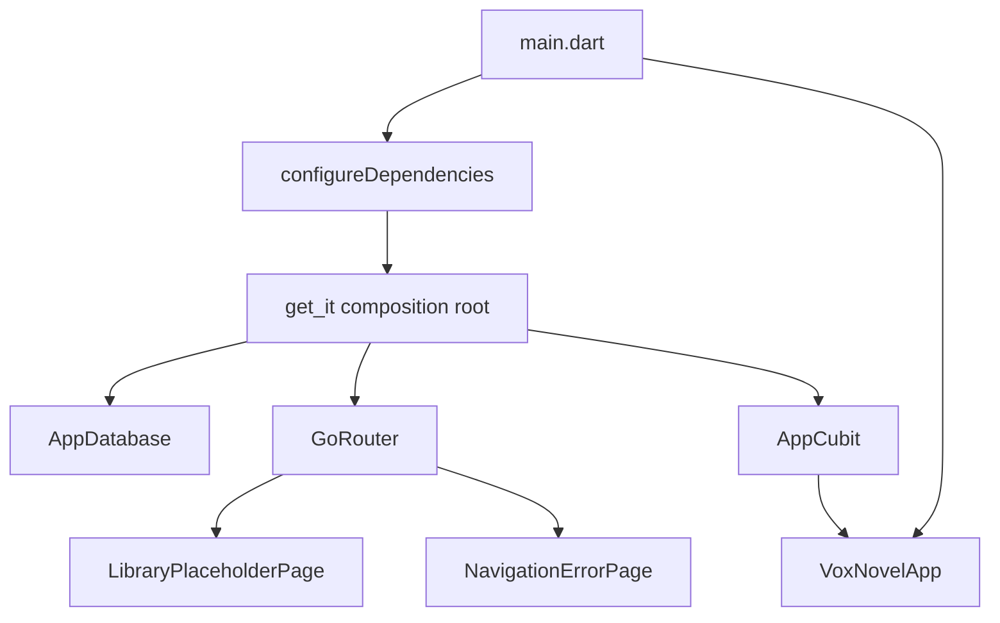

# Foundation Design

**Spec**: `.specs/features/foundation/spec.md`
**Status**: Approved

## Architecture Overview

Use the approved feature-first pragmatic structure. `main.dart` performs binding
initialization and awaits the application composition root. The root app receives
its router and app-level Cubit explicitly. `get_it` owns long-lived infrastructure
instances at the composition boundary; feature classes receive dependencies through
constructors and do not query the locator directly.



Planned source shape:

```text
lib/
├── main.dart
├── app/
│   ├── app.dart
│   ├── app_cubit.dart
│   ├── app_state.dart
│   ├── dependency_injection/
│   │   └── configure_dependencies.dart
│   └── router/
│       └── app_router.dart
├── core/
│   └── database/
│       └── app_database.dart
└── features/
    └── library/
        └── presentation/
            └── pages/
                └── library_placeholder_page.dart
```

## Code Reuse Analysis

### Existing Components to Leverage

| Component | Location | How to Use |
| --------- | -------- | ---------- |
| Flutter entry point | `lib/main.dart` | Replace the generated counter bootstrap with async composition and `VoxNovelApp`. |
| Material application | `lib/main.dart` | Preserve Material 3 primitives through `MaterialApp.router`. |
| Flutter test harness | `test/widget_test.dart` | Replace the generated counter smoke test with spec-derived shell tests. |
| Recommended lints | `analysis_options.yaml` | Retain `flutter_lints` as the baseline and make analysis a gate. |
| Android Gradle project | `android/` | Reuse the generated Android build configuration in CI. |

### Integration Points

| System | Integration Method |
| ------ | ------------------ |
| Cubit | `BlocProvider.value` exposes the composition-owned `AppCubit` above the routed application. |
| Router | `MaterialApp.router(routerConfig: appRouter)` owns route resolution and error rendering. |
| Drift | `AppDatabase` accepts a `QueryExecutor`; production uses `driftDatabase`, tests use `NativeDatabase.memory()`. |
| Dependency injection | One `GetIt` instance is configured through an idempotent `configureDependencies` function and reset in tests. |
| GitHub Actions | A pinned Flutter setup action restores packages, analyzes, tests, then builds a debug APK. |

## Components

### Application Entry Point

- **Purpose**: Initialize Flutter bindings, await dependency composition, and render the app.
- **Location**: `lib/main.dart`
- **Interface**:
  - `Future<void> main()` — completes dependency initialization before `runApp`.
- **Dependencies**: `configureDependencies`, `VoxNovelApp`.
- **Reuses**: Existing Flutter entry point.

### VoxNovelApp

- **Purpose**: Own the Material application boundary and expose app-level state.
- **Location**: `lib/app/app.dart`
- **Interface**:
  - `VoxNovelApp({required GoRouter router, required AppCubit appCubit})`
- **Dependencies**: `flutter_bloc`, `go_router`.
- **Reuses**: Material 3 theme primitives.

### AppCubit

- **Purpose**: Establish the approved method-driven presentation-state pattern with an explicit startup transition.
- **Location**: `lib/app/app_cubit.dart`, `lib/app/app_state.dart`
- **Interfaces**:
  - `AppCubit()` — begins in `AppStatus.initial`.
  - `void markReady()` — emits `AppStatus.ready`.
- **Dependencies**: `Cubit<AppState>`.
- **Reuses**: None; this is the presentation-state convention.

### Composition Root

- **Purpose**: Register, resolve, and reset long-lived foundation dependencies deterministically.
- **Location**: `lib/app/dependency_injection/configure_dependencies.dart`
- **Interfaces**:
  - `Future<void> configureDependencies({GetIt? instance, QueryExecutor? databaseExecutor})`
  - `Future<void> resetDependencies({GetIt? instance})`
- **Dependencies**: `get_it`, `AppDatabase`, `AppCubit`, app router factory.
- **Reuses**: None; the generated scaffold has no composition root.

### App Router

- **Purpose**: Define the root route and visible unknown-route failure behavior.
- **Location**: `lib/app/router/app_router.dart`
- **Interfaces**:
  - `GoRouter createAppRouter()`
- **Dependencies**: `go_router`, placeholder page.
- **Reuses**: None.

### Library Placeholder Page

- **Purpose**: Provide the deterministic initial destination without implementing library behavior.
- **Location**: `lib/features/library/presentation/pages/library_placeholder_page.dart`
- **Interface**:
  - `const LibraryPlaceholderPage()`
- **Dependencies**: Flutter Material.
- **Reuses**: None.

### AppDatabase

- **Purpose**: Establish Drift lifecycle and an injectable executor without prematurely owning product tables.
- **Location**: `lib/core/database/app_database.dart`
- **Interfaces**:
  - `AppDatabase(QueryExecutor executor)`
  - `AppDatabase.defaults()`
  - inherited `Future<void> close()`
- **Dependencies**: `drift`, `drift_flutter`, generated Drift code.
- **Reuses**: Drift's custom-executor pattern, which supports in-memory testing.

### Continuous Integration Workflow

- **Purpose**: Reproduce the build-level gate on GitHub.
- **Location**: `.github/workflows/ci.yml`
- **Execution order**: checkout → Flutter setup → `flutter pub get` → `flutter analyze` → `flutter test` → `flutter build apk --debug`.
- **Dependencies**: GitHub Actions Ubuntu runner, Java, Flutter.
- **Reuses**: Existing Android Gradle project.

## Data Models

### AppState

```dart
enum AppStatus { initial, ready }

final class AppState {
  const AppState(this.status);
  final AppStatus status;
}
```

No product database table is created in this milestone. `AppDatabase.schemaVersion`
starts at `1`; later table-owning features add schema and migration tests.

## Error Handling Strategy

| Error Scenario | Handling | User Impact |
| -------------- | -------- | ----------- |
| Unknown route | `GoRouter.errorBuilder` renders a dedicated error scaffold containing the attempted location. | A visible navigation error replaces a blank screen. |
| Duplicate dependency setup in tests | `configureDependencies` checks registrations; `resetDependencies` disposes and clears the selected `GetIt` instance. | Repeated setup is deterministic. |
| Database initialization failure | Allow startup future to fail and make the error observable to tests/platform logs. | App does not render a falsely ready shell. |
| CI command failure | Default shell fail-fast behavior stops the job. | The check is marked failed. |

## Risks & Concerns

| Concern | Location | Impact | Mitigation |
| ------- | -------- | ------ | ---------- |
| Generated counter app has no separation or product shell. | `lib/main.dart:1` | Future features would accumulate in one file. | Replace it with a thin entry point and explicit app/router/composition modules. |
| Existing widget test only validates template counter behavior. | `test/widget_test.dart:1` | It provides no evidence for product requirements. | Replace it with spec-derived router and shell tests. |
| Flutter commands attempt to update SDK cache outside the workspace sandbox. | Local Flutter SDK installation | Local gates cannot run without approved elevated execution. | Run required Flutter commands with the already approved Flutter command scope. |
| An empty Drift schema has limited business value. | Planned `app_database.dart` | Risk of premature schema ownership. | Test executor lifecycle only; add tables with their owning product features. |
| `get_it` can hide dependencies if used throughout features. | Planned composition root | Tight coupling and difficult tests. | Restrict locator access to `main.dart` and the composition module; use constructor injection elsewhere. |

## Tech Decisions

| Decision | Choice | Rationale |
| -------- | ------ | --------- |
| Architecture depth | Feature-first pragmatic | Approved approach; creates layers only when they carry behavior. |
| Presentation state | Cubit | Explicit user decision; direct method-based transitions. |
| DI | `get_it` composition root | Minimal DI-only mechanism; test-reset support. |
| Navigation | `go_router` | Explicit user decision and official Flutter-published router package. |
| Persistence opening | `drift_flutter` production constructor plus injected `QueryExecutor` | Current Drift-supported cross-platform opening with an in-memory test seam. |
| CI | One ordered Android job | Makes failure ordering and the required build gate explicit. |

## Verified Package Guidance

- [`flutter_bloc`](https://pub.dev/packages/flutter_bloc) integrates with Cubit and Bloc; the design uses only Cubit.
- [`go_router`](https://pub.dev/packages/go_router) is the Flutter-published declarative Router API package.
- [`drift`](https://pub.dev/packages/drift) provides typed SQLite persistence and transactions.
- [`drift_flutter`](https://pub.dev/packages/drift_flutter) provides `driftDatabase` and documents a custom constructor for in-memory tests.
- [`get_it`](https://pub.dev/packages/get_it) supplies the service-locator/composition mechanism; access remains boundary-scoped.
