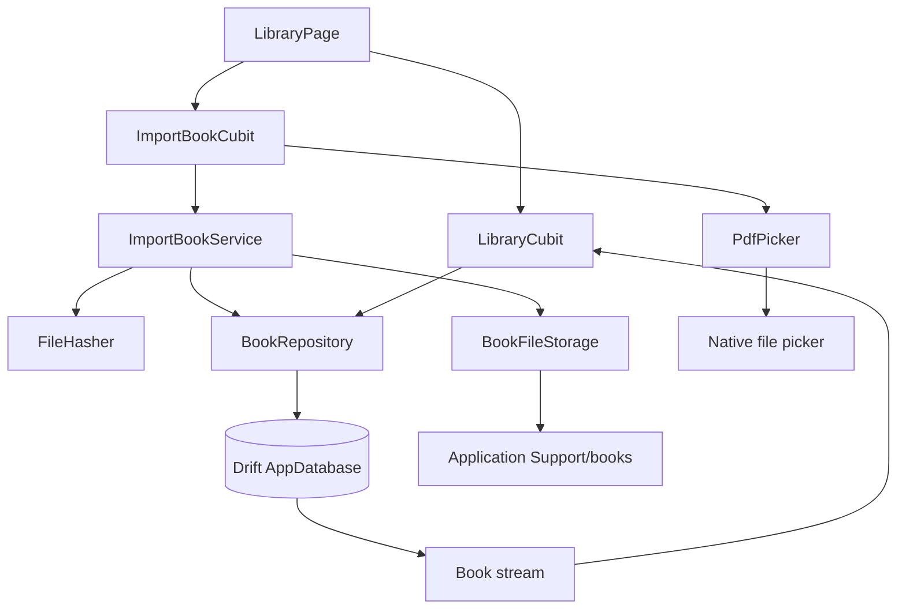
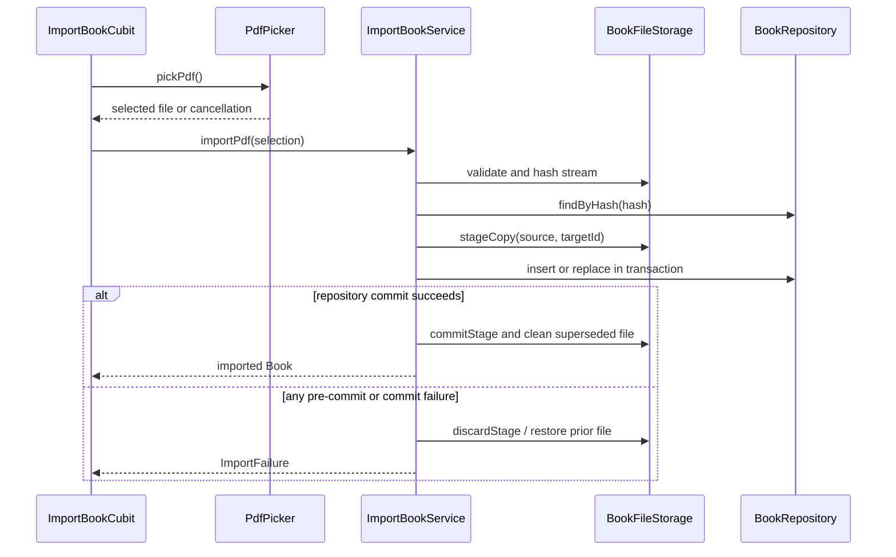

# Library and Import Design

**Spec**: `.specs/features/library_import/spec.md`
**Status**: Approved

---

## Architecture Overview

Use the approved pragmatic feature-first approach. The `library` feature owns the
`Book` domain model, Drift table/repository, library query state, edit/delete
behavior, and library UI. The `import_book` feature owns picker and import
orchestration. Platform-dependent picker, hashing, and filesystem work sit behind
constructor-injected contracts, with implementations at the data boundary.

The database is the source of truth for visible library state. File mutations use
application-private staging paths and compensating operations around Drift
transactions because SQLite and the device filesystem cannot share one atomic
transaction.



### Import sequence



File reading, SHA-256 hashing, and copying use chunked streams. The service invokes
the heavy filesystem pipeline through an isolate-capable adapter so the Cubit and
widget tree remain responsive; tests inject an in-process fake.

---

## Code Reuse Analysis

### Existing Components to Leverage

| Component | Location | How to Use |
| --------- | -------- | ---------- |
| Drift database boundary | `lib/core/database/app_database.dart` | Add the feature-owned `Books` table, schema migration, and generated accessors. |
| Composition root | `lib/app/dependency_injection/configure_dependencies.dart` | Register concrete storage, repository, services, and Cubits; preserve constructor injection outside this file. |
| Router factory | `lib/app/router/app_router.dart` | Replace the placeholder destination with an injected library-page builder while preserving unknown-route behavior. |
| Library placeholder | `lib/features/library/presentation/pages/library_placeholder_page.dart` | Replace with the real `LibraryPage`; its exact `Biblioteca` title remains the route contract. |
| Cubit convention | `lib/app/app_cubit.dart` | Follow immutable state plus direct method transitions; no event-based BLoC. |
| In-memory database tests | `test/core/database/app_database_test.dart` | Extend the existing `NativeDatabase.memory()` seam for schema/repository integration tests. |
| GetIt lifecycle tests | `test/app/dependency_injection/configure_dependencies_test.dart` | Prove feature dependencies are singleton-scoped and disposable/resettable. |

### Integration Points

| System | Integration Method |
| ------ | ------------------ |
| Native document picker | `file_picker` adapter calls one-file custom selection with `allowedExtensions: ['pdf']`; cancellation maps to a domain cancellation result. |
| Application-private storage | `path_provider` resolves Application Support, then `BookFileStorage` owns `books/`, `.staging/`, and cleanup paths. |
| SHA-256 | `crypto` chunked conversion hashes file streams without loading an entire novel into memory. |
| Drift | `Books` is added to `AppDatabase`; a unique hash index enforces one record per content hash. |
| Presentation refresh | `BookRepository.watchAll()` emits newest-updated-first rows after committed Drift writes. |

---

## Components

### Book domain model

- **Purpose**: Represent the persisted library contract without exposing Drift rows.
- **Location**: `lib/features/library/domain/entities/book.dart`
- **Interfaces**:
  - `Book` immutable value with all Milestone 1 fields.
  - `BookStatus` enum containing `importing`, `processing`, `ready`, `failed`, and `unsupported`.
- **Dependencies**: Dart core only.
- **Reuses**: Product data model from `docs/spec.md`.

### BookRepository contract

- **Purpose**: Define observable library queries and atomic metadata mutations.
- **Location**: `lib/features/library/domain/repositories/book_repository.dart`
- **Interfaces**:
  - `Stream<List<Book>> watchAll()` — newest `updatedAt` first.
  - `Future<Book?> findByHash(String hash)`
  - `Future<Book?> findById(String id)`
  - `Future<void> insert(Book book)`
  - `Future<void> replaceImportedFile(...)`
  - `Future<void> updateMetadata({required String id, required String title, required String? author, required DateTime updatedAt})`
  - `Future<void> deleteById(String id)`
- **Dependencies**: `Book`.
- **Reuses**: Constructor-injection boundary established by AD-003.

### Drift book persistence

- **Purpose**: Persist and stream books with uniqueness and deterministic ordering.
- **Location**: `lib/features/library/data/database/books.dart`,
  `lib/features/library/data/repositories/drift_book_repository.dart`,
  `lib/core/database/app_database.dart`
- **Interfaces**: Implements `BookRepository`.
- **Dependencies**: Drift-generated table and `AppDatabase`.
- **Reuses**: Existing database executor and in-memory test constructor.

### PdfPicker

- **Purpose**: Translate native picker results into one platform-neutral selection.
- **Location**: `lib/features/import_book/domain/services/pdf_picker.dart`,
  `lib/features/import_book/data/services/file_picker_pdf_picker.dart`
- **Interfaces**:
  - `Future<PickedPdf?> pickPdf()` — `null` means intentional cancellation.
- **Dependencies**: `file_picker` only in the concrete adapter.
- **Reuses**: None; this is the first native picker boundary.

### BookFileStorage

- **Purpose**: Validate, hash, stage, commit, restore, and remove application-owned book files.
- **Location**: `lib/features/import_book/domain/services/book_file_storage.dart`,
  `lib/features/import_book/data/services/local_book_file_storage.dart`
- **Interfaces**:
  - `Future<ValidatedPdf> validateAndHash(PickedPdf source)`
  - `Future<StagedBookFile> stageCopy({required PickedPdf source, required String bookId})`
  - `Future<String> commitStage(StagedBookFile staged)`
  - `Future<void> discardStage(StagedBookFile staged)`
  - `Future<void> removeOwnedFiles({required String pdfPath, String? coverPath})`
- **Dependencies**: `dart:io`, `crypto`, application-support directory resolver.
- **Reuses**: Privacy and adapter isolation requirements from `docs/spec.md`.

The production implementation resolves `<application-support>/books`, validates
canonical paths before deletion, and never deletes a source path selected outside
the application-owned root. A staged file uses a unique temporary suffix and is
renamed only at commit.

### ImportBookService

- **Purpose**: Orchestrate new import and duplicate replacement with compensation.
- **Location**: `lib/features/import_book/domain/services/import_book_service.dart`
- **Interfaces**:
  - `Future<Book> importPdf(PickedPdf selected)`
- **Dependencies**: `BookRepository`, `BookFileStorage`, ID generator, clock.
- **Reuses**: Stable book model and repository stream.

For a new hash, it stages the copy, commits the owned file, inserts the row, and
removes the committed copy if insertion fails. For a duplicate hash, it preserves
the existing identity and edited metadata, stages a replacement, swaps through a
backup path, updates the row, then removes the backup. Any failure before durable
completion invokes the inverse operations in reverse order.

### LibraryCubit

- **Purpose**: Subscribe to the ordered library and manage list/grid and edit/delete UI state.
- **Location**: `lib/features/library/presentation/cubit/library_cubit.dart`,
  `lib/features/library/presentation/cubit/library_state.dart`
- **Interfaces**:
  - `Future<void> start()`
  - `void showList()`
  - `void showGrid()`
  - `Future<MetadataEditResult> updateMetadata(...)`
  - `Future<DeleteBookResult> deleteBook(Book book)`
- **Dependencies**: `BookRepository`, owned-file deletion coordinator.
- **Reuses**: Cubit-only presentation convention from AD-002.

### ImportBookCubit

- **Purpose**: Guard single-flight selection/import and expose exact busy/error outcomes.
- **Location**: `lib/features/import_book/presentation/cubit/import_book_cubit.dart`,
  `lib/features/import_book/presentation/cubit/import_book_state.dart`
- **Interfaces**:
  - `Future<void> pickAndImport()`
- **Dependencies**: `PdfPicker`, `ImportBookService`.
- **Reuses**: Cubit-only presentation convention.

State is `idle`, `selecting`, or `importing`, plus an optional one-shot error
message. Calls made outside `idle` return immediately.

### LibraryPage and dialogs

- **Purpose**: Render empty/content/busy states, layout controls, metadata editing, and deletion confirmation.
- **Location**:
  - `lib/features/library/presentation/pages/library_page.dart`
  - `lib/features/library/presentation/widgets/book_list_item.dart`
  - `lib/features/library/presentation/widgets/book_grid_item.dart`
  - `lib/features/library/presentation/widgets/edit_book_dialog.dart`
- **Interfaces**: Flutter widgets receiving state through `BlocBuilder`/`BlocListener`.
- **Dependencies**: `LibraryCubit`, `ImportBookCubit`, Material.
- **Reuses**: Existing `Biblioteca` route and Material 3 root app.

The app bar exposes mutually exclusive accessible list/grid controls. The import
action is an accessible FAB labeled `Importar PDF`, disabled while selection or
import is active. A modal progress barrier prevents another import but does not
block frame rendering.

### Feature composition

- **Purpose**: Register repository, services, adapters, and Cubits centrally.
- **Location**: `lib/app/dependency_injection/configure_dependencies.dart`,
  `lib/app/router/app_router.dart`
- **Interfaces**: Existing `configureDependencies` and router factory gain optional
  injected platform seams for tests.
- **Dependencies**: `get_it`, feature contracts and concrete adapters.
- **Reuses**: AD-003 single composition root.

---

## Data Models

### Book

```dart
enum BookStatus { importing, processing, ready, failed, unsupported }

final class Book {
  const Book({
    required this.id,
    required this.title,
    required this.originalFileName,
    required this.storedFilePath,
    required this.fileHash,
    required this.status,
    required this.processingProgress,
    required this.createdAt,
    required this.updatedAt,
    this.author,
    this.coverPath,
  });

  final String id;
  final String title;
  final String? author;
  final String? coverPath;
  final String originalFileName;
  final String storedFilePath;
  final String fileHash;
  final BookStatus status;
  final double processingProgress;
  final DateTime createdAt;
  final DateTime updatedAt;
}
```

Milestone 2 and later may add page/chapter/progress columns through migrations;
they are not persisted prematurely here.

### Books Drift table

| Column | SQLite shape | Constraint |
| ------ | ------------ | ---------- |
| `id` | text | primary key |
| `title` | text | non-empty enforced by repository validation |
| `author` | nullable text | trimmed or null |
| `cover_path` | nullable text | application-owned path only |
| `original_file_name` | text | required |
| `stored_file_path` | text | required |
| `file_hash` | text | required, unique |
| `status` | text | enum converter |
| `processing_progress` | real | `0.0` in this milestone |
| `created_at` | integer datetime | stable across replacement |
| `updated_at` | integer datetime | ordering key |

`AppDatabase.schemaVersion` moves from 1 to 2. The `onUpgrade` migration from
version 1 creates `Books`; fresh databases create the complete schema.

### Presentation states

```dart
enum LibraryLayout { list, grid }
enum LibraryLoadStatus { initial, loading, ready, failure }
enum ImportBookStatus { idle, selecting, importing }

final class LibraryState {
  final LibraryLoadStatus status;
  final LibraryLayout layout;
  final List<Book> books;
  final String? errorMessage;
}

final class ImportBookState {
  final ImportBookStatus status;
  final String? errorMessage;
}
```

---

## Error Handling Strategy

| Error Scenario | Handling | User Impact |
| -------------- | -------- | ----------- |
| Picker cancellation | Return `null`; Cubit transitions to idle without an error. | Library remains unchanged. |
| Missing, unreadable, directory, or non-PDF source | Typed validation failure before staging. | `Não foi possível importar este PDF`. |
| Hash/copy/storage failure | Remove stage and return typed import failure. | Existing library remains unchanged; standard import error. |
| New-book database insert failure | Remove committed private copy as compensation. | Standard import error; no record or orphan active file. |
| Duplicate replacement failure | Restore backup/file and leave or restore prior row. | Existing book remains usable; standard import error. |
| Empty edited title | Validate before repository call. | Inline `Informe o título`; dialog remains open. |
| Metadata database failure | Do not optimistically replace stream data. | `Não foi possível salvar as alterações`. |
| Deletion cancelled | Perform no mutation. | Dialog closes and book remains. |
| Owned-file quarantine failure | Abort before deleting the row and restore moved files. | `Não foi possível excluir o livro`. |
| Post-commit trash cleanup failure | Record sanitized cleanup error and retry cleanup at the next storage initialization. | Book remains deleted; no referenced active file remains. |
| Library stream/database failure | Preserve last successful books and expose a retryable error state. | Visible library error without a false empty state. |

---

## Risks & Concerns

| Concern | Location | Impact | Mitigation |
| ------- | -------- | ------ | ---------- |
| Database and filesystem cannot participate in one atomic transaction. | New `ImportBookService` and deletion coordinator | Partial failure could create orphan files or broken records. | Stage/quarantine first, commit one boundary at a time, record compensating operations, and test every injected failure point. |
| Current database has no migration strategy beyond schema version 1. | `lib/core/database/app_database.dart:12` | Adding `Books` could break existing installations. | Add explicit `MigrationStrategy`, version-1 upgrade test, and fresh-schema test. |
| Current router directly constructs a const placeholder. | `lib/app/router/app_router.dart:9` | Real page dependencies cannot be injected or isolated in tests. | Inject a library-page builder from the composition root while retaining the default production path. |
| Existing library tests cover only a title and semantics label. | `test/features/library/presentation/pages/library_placeholder_page_test.dart:5` | No evidence for persistence, layouts, errors, editing, or deletion. | Replace with spec-mapped Cubit, repository, service, and widget tests; retain the title/semantics contract. |
| Large PDF hash/copy work can block frames or exhaust memory. | New `LocalBookFileStorage` | Violates responsiveness and large-file requirements. | Use chunked streams and an isolate-capable production operation; add a widget/Cubit responsiveness test with a controlled pending future. |
| Platform picker paths can be nullable or refer to provider-managed cache files. | New `FilePickerPdfPicker` | A source may disappear before copy. | Treat missing path/disappearance as typed validation failure and copy immediately into app support storage. |
| Deletion given an arbitrary path could remove user files. | New `LocalBookFileStorage` | Destructive privacy/security defect. | Canonicalize and reject deletion outside the application-owned books root; test traversal and external paths. |

---

## Tech Decisions

| Decision | Choice | Rationale |
| -------- | ------ | --------- |
| Architecture | Feature-first repository + storage service + Cubits | User-approved balance of isolation and low ceremony; conforms to AD-001 through AD-005. |
| Library source of truth | Drift watch query | Keeps UI synchronized only with committed durable state. |
| Duplicate identity | Unique SHA-256 plus stable existing book ID | Enforces deterministic replacement and preserves user metadata. |
| File location | Application Support under a dedicated owned root | Persistent, private application data is supported on Android and future native platforms. |
| File processing | Chunked stream adapter with isolate-capable production execution | Avoids whole-file memory loads and UI-isolate blocking. |
| Cross-resource consistency | Staging/quarantine plus compensating operations | Database/filesystem transactions cannot be unified. |
| IDs | Injected UUID generator | Stable uniqueness in production and deterministic tests. |
| Time | Injected clock | Exact timestamp and ordering assertions without sleeps. |
| Layout state | Cubit-only, default list | Matches confirmed scope and avoids premature settings persistence. |

---

## Verified Package Guidance

- [`file_picker`](https://pub.dev/packages/file_picker) supports native single-file
  selection and custom extension filtering with `allowedExtensions: ['pdf']`.
- [`path_provider`](https://pub.dev/packages/path_provider) exposes Application
  Support on Android and the other targeted native platforms.
- [`crypto`](https://pub.dev/packages/crypto) provides SHA-256 and chunked
  conversion so files do not need to be loaded completely into memory.
- [Drift transactions](https://drift.simonbinder.eu/dart_api/transactions/) make
  database statements atomic and publish stream-query changes only after commit;
  every operation inside the transaction must be awaited.
