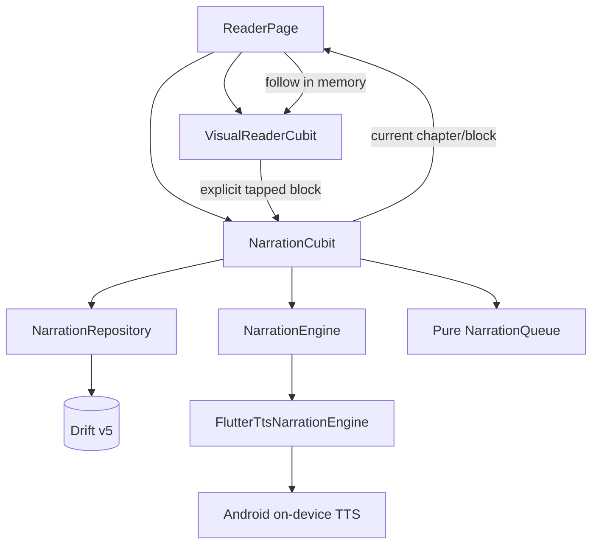
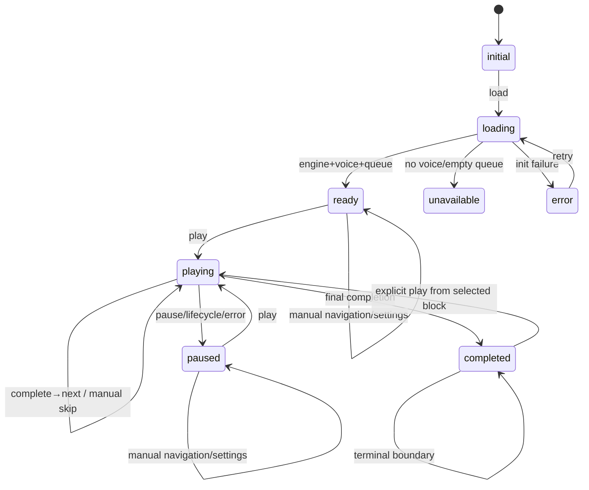

# Narration Design

**Spec**: `.specs/features/narration/spec.md`
**Context**: `.specs/features/narration/context.md`
**Status**: Approved

---

## Approach Selection

The approved architecture adds a route-scoped `NarrationCubit`, a singleton
`NarrationEngine` adapter backed by `flutter_tts`, a narration repository, and
small reader-integration components. `VisualReaderCubit` remains the owner of
visual state; the reader page coordinates only user intent and in-memory
narration highlighting.

Rejected alternatives:

- Extending `VisualReaderCubit` would combine PDF/text display, visual
  persistence, engine callbacks, queue state, and narration progress.
- A global stream/actor media service would prematurely introduce Milestone 5
  background ownership and audio-session complexity.

---

## Research Findings

`flutter_tts 4.2.5` is selected behind an adapter:

- The official package supports Android `speak`, `stop`, installed voices,
  `setVoice`, and `setSpeechRate`.
- Voices are maps containing at least `name` and `locale`.
- `awaitSpeakCompletion(true)` makes each `speak` future complete with its
  utterance, which allows the controller to associate completion with its own
  monotonic generation.
- Android pause is implemented by the package as a workaround rather than a
  native engine capability. This design therefore uses stop + restart-current-
  block instead of native pause.
- Android 11+ package visibility requires a
  `android.intent.action.TTS_SERVICE` query in the application manifest.
- Android minimum SDK must be 21 or newer; the project target will be verified
  before adding the dependency.

Sources:

- `https://pub.dev/packages/flutter_tts`
- `https://pub.dev/documentation/flutter_tts/latest/flutter_tts/FlutterTts-class.html`
- `https://pub.dev/packages/flutter_tts/changelog`

No plugin types cross the data/domain/presentation contracts.

---

## Architecture Overview



Ownership rules:

- `NarrationEngine` is one application singleton and initializes once.
- Each reader route owns one `NarrationCubit` and one `VisualReaderCubit`.
- One `NarrationCubit` owns one book queue and one playback generation.
- The engine is foreground single-owner: starting a new route/controller first
  stops any active utterance through the registry.
- Drift owns global settings, book overrides, and progress.

---

## Code Reuse Analysis

### Existing Components to Leverage

| Component | Location | How to Use |
| --- | --- | --- |
| `ReaderBookContent` / `ReaderChapter` | `lib/features/visual_reader/domain/entities/reader_models.dart` | Source of exact active-run ordered chapters and blocks |
| `VisualReaderRepository.loadContent` | visual-reader repository | Load and validate the same active aggregate for narration |
| `NarrationBlockDraft.normalizedText` | PDF-processing domain | Exact engine input; never mutate display/original text |
| `VisualReaderCubit` | visual-reader presentation | Add one non-persisting `followNarration` transition only |
| `ReaderPage` composition seams | visual-reader page | Host two Cubits and injected player/engine surfaces without global calls |
| Drift write-tail pattern | `DriftVisualReaderRepository` | Apply adversarially tested per-book request-order serialization |
| Route Cubit registry | application DI | Reuse close-all/route-close lifecycle pattern for narration controllers |
| Material semantics and reader palettes | visual-reader widgets/theme | Player bar contrast, tooltips, target sizes, selected/disabled semantics |

### Integration Points

| System | Integration Method |
| --- | --- |
| Database | Schema v5 adds global narration settings, per-book overrides, and per-book progress |
| Reader selection | User tap calls both visual selection and `NarrationCubit.setPendingStart`; passive browsing does not save narration progress |
| Narration highlight | Narration state listener calls `VisualReaderCubit.followNarration`, which emits chapter/block without visual persistence |
| App lifecycle | `ReaderPage` implements `WidgetsBindingObserver`, immediately marks narration paused and awaits stop/progress through Cubit |
| DI | Engine/repository singletons plus a route-scoped narration registry |
| Android | Add local TTS plugin dependency and TTS service query only; no background/media service permissions |

---

## Components

### Narration domain models

- **Purpose**: Express voice identity, resolved settings, durable progress,
  player states, queue entries, and validation without Flutter/plugin types.
- **Location**: `lib/features/narration/domain/entities/narration_models.dart`
- **Interfaces**:
  - `NarrationVoice(name, locale)`
  - `NarrationSettings(voice, rate)` and defaults/resolution input
  - `BookNarrationOverride`
  - `NarrationProgress`
  - `NarrationQueueEntry`
  - `NarrationStatus`
- **Dependencies**: active-run IDs and processed block identities only.
- **Reuses**: UTC timestamp conventions and immutable equality patterns.

Validation:

- non-empty voice name/locale;
- normalized rate stored to one decimal and in `0.5...2.0`;
- progress has book/run/chapter/block IDs together;
- completed is valid only for the final active queue entry when restored;
- all persisted dates are UTC.

### NarrationQueue

- **Purpose**: Flatten non-empty source-order blocks and provide pure
  first/previous/next/final/stale-resolution behavior.
- **Location**: `lib/features/narration/domain/services/narration_queue.dart`
- **Interfaces**:
  - `NarrationQueue.fromContent(ReaderBookContent content)`
  - `entryFor(chapterId, blockId)`
  - `previous(entry)` / `next(entry)`
  - `first` / `last`
- **Dependencies**: `ReaderBookContent`.
- **Reuses**: already validated numeric chapter/block order.

Empty chapters contribute no entries. Queue entries retain chapter title and
exact `normalizedText` reference; no novel text is copied to logs or persistence.

### NarrationSettingsResolver

- **Purpose**: Sort voices and resolve global/book/missing-voice fallback.
- **Location**:
  `lib/features/narration/domain/services/narration_settings_resolver.dart`
- **Interfaces**:
  - `sortVoices(voices)` — locale then name, stable exact order.
  - `resolve(voices, global, override)` — override > global > first voice.
  - `repairMissingVoice(...)` — same locale first, then first overall.
- **Dependencies**: domain models only.

### NarrationEngine

- **Purpose**: Isolate the on-device engine and provide completion as
  request-scoped futures rather than unscoped global callbacks.
- **Location**:
  `lib/features/narration/domain/services/narration_engine.dart`
- **Interfaces**:
  - `Future<List<NarrationVoice>> initialize()`
  - `Future<void> configure(NarrationVoice voice, double rate)`
  - `Future<void> speak(String text)`
  - `Future<void> stop()`
  - `Future<void> close()`
- **Dependencies**: none at contract level.

The contract guarantees `speak` completes only when that request completes or
fails. Controller generations still guard every await continuation because
stop/new play can invalidate an in-flight future.

### FlutterTtsNarrationEngine

- **Purpose**: Implement the engine contract with `flutter_tts 4.2.5`.
- **Location**:
  `lib/features/narration/data/services/flutter_tts_narration_engine.dart`
- **Interfaces**: implements `NarrationEngine`.
- **Dependencies**: `FlutterTts`, injectable plugin facade for focused tests.
- **Reuses**: composition-root singleton disposal.

Initialization caches one future, calls `awaitSpeakCompletion(true)`, retrieves
and strictly maps voices with non-empty name/locale, deduplicates by the pair,
then sorts through the resolver. `configure` calls exact `setVoice` and
`setSpeechRate`. Non-success plugin results become typed adapter failures.

No global completion handler drives player state. The future returned by each
`speak` is awaited by the controller generation that initiated it.

### NarrationRepository

- **Purpose**: Load/save global settings, optional book override, and complete
  narration progress with request-order durability.
- **Location**:
  `lib/features/narration/domain/repositories/narration_repository.dart`
- **Interfaces**:
  - `loadGlobalSettings()`
  - `saveGlobalSettings(settings)`
  - `loadBookOverride(bookId)`
  - `saveBookOverride(override)` / `deleteBookOverride(bookId)`
  - `loadProgress(bookId)`
  - `saveProgress(progress)`
- **Dependencies**: domain models only.

### DriftNarrationRepository

- **Purpose**: Implement atomic upserts, override removal, progress order, and
  deletion cascades.
- **Location**:
  `lib/features/narration/data/repositories/drift_narration_repository.dart`
- **Dependencies**: `AppDatabase`.

Global and override writes replace complete records. Progress uses one
per-book future tail with an injectable pre-write seam; tests hold the first
physical write to prove newest-request ordering. A failed write does not poison
later writes.

### NarrationCubit

- **Purpose**: Own initialization, queue, setting resolution/preview,
  playback generation, progress restore/repair, manual/automatic advancement,
  exact errors, and lifecycle pause.
- **Location**:
  `lib/features/narration/presentation/cubit/narration_cubit.dart`
- **Interfaces**:
  - `load(ReaderBookContent content)`
  - `retryInitialization()`
  - `setPendingStart(chapterId, blockId)`
  - `play()` / `pause()`
  - `previous()` / `next()`
  - `selectVoice(voice)` / `setRate(rate)`
  - `enableBookOverride()` / `removeBookOverride()`
  - `previewVoice(voice)`
  - `onAppLifecyclePause()`
  - `reloadContent(content)`
  - `clearMessage()` / `close()`
- **Dependencies**: repository, engine, queue/resolver, clock.

State:

```text
NarrationState
  status: initial | loading | ready | playing | paused |
          completed | unavailable | error
  voices: List<NarrationVoice>
  settings: NarrationSettings?
  usesBookOverride: bool
  bookId/runId: String?
  chapterId/blockId: String?
  chapterTitle: String?
  canPrevious/canNext: bool
  pendingVisualStart: (chapterId, blockId)?
  message: String?
```

#### Playback generation

`_generation` increments before stop, pause, manual navigation, preview,
reload, lifecycle pause, and close.

```text
play entry E:
  generation = ++_generation
  configure settings
  emit playing(E)
  await engine.speak(E.normalizedText)
  if generation != _generation: ignore
  await persist completed(E)
  if generation != _generation: ignore
  advance or emit completed
```

Duplicate completion cannot advance twice because one `speak` future has one
continuation and the generation increments before the next speak.

#### Persistence-before-advance

On successful completion, save a complete progress record for the completed
entry. Only after that future succeeds does state move/speak next. On progress
failure, remain paused on the entry and show the exact save error; later user
actions may enqueue new writes.

#### Immediate lifecycle state

`onAppLifecyclePause()` synchronously increments generation and emits paused
before returning its future. The future awaits engine stop then exact current
progress. The route registry/close awaits this future before database disposal.

### NarrationPlayerBar

- **Purpose**: Persistent foreground controls and exact state/semantics.
- **Location**:
  `lib/features/narration/presentation/widgets/narration_player_bar.dart`
- **Interfaces**: state plus play/pause/previous/next/settings/retry callbacks.
- **Dependencies**: Material widgets only.

The bar displays exact current chapter, voice/rate access, and 48×48 minimum
targets. Controls derive enabled state from narration status and queue bounds.

### NarrationSettingsSheet

- **Purpose**: List sorted voices, preview, global/book scope, and bounded rate.
- **Location**:
  `lib/features/narration/presentation/widgets/narration_settings_sheet.dart`
- **Interfaces**: narration state and callbacks.
- **Dependencies**: domain models.

### ReaderNarrationHost

- **Purpose**: Keep `ReaderPage` small by composing the player Cubit, lifecycle
  observer, player bar/settings sheet, and visual synchronization.
- **Location**:
  `lib/features/narration/presentation/widgets/reader_narration_host.dart`
- **Interfaces**:
  - content + current visual selection;
  - user selection callback;
  - `onNarrationFocus(chapterId, blockId)` for non-persisting visual follow;
  - child reader body.
- **Dependencies**: both Cubits, player widgets.

`ReaderPage` delegates player/lifecycle concerns to this host. It adds only:

- call `setPendingStart` when a user taps a block;
- call `VisualReaderCubit.followNarration` for player focus;
- provide loaded `ReaderBookContent`.

---

## Data Models

### Global narration settings

```text
narration_settings
  id: INTEGER PRIMARY KEY CHECK(id = 1)
  voice_name: TEXT NULL
  voice_locale: TEXT NULL
  speech_rate: REAL NOT NULL DEFAULT 1.0
  updated_at: INTEGER NOT NULL UTC
```

Voice fields are both null (no prior voice) or both non-empty. The first
available voice is resolved and persisted after engine initialization.

### Per-book narration override

```text
book_narration_settings
  book_id: TEXT PRIMARY KEY REFERENCES books(id) ON DELETE CASCADE
  voice_name: TEXT NOT NULL
  voice_locale: TEXT NOT NULL
  speech_rate: REAL NOT NULL
  updated_at: INTEGER NOT NULL UTC
```

Row presence means override enabled. Removing the row immediately restores the
global resolved setting.

### Reading progress

```text
reading_progress
  book_id: TEXT PRIMARY KEY REFERENCES books(id) ON DELETE CASCADE
  active_run_id: TEXT NOT NULL
  chapter_id: TEXT NOT NULL
  block_id: TEXT NOT NULL
  completed: INTEGER NOT NULL CHECK(completed IN (0,1))
  voice_name: TEXT NOT NULL
  voice_locale: TEXT NOT NULL
  speech_rate: REAL NOT NULL
  updated_at: INTEGER NOT NULL UTC
```

Derived IDs deliberately are not foreign keys: reprocessing deletes the old
run, and retained identities allow deterministic stale detection/repair.
`book_id` cascades on deletion.

### NarrationProgress semantics

- Incomplete progress points to the block that should speak on next play.
- A paused/current/manual-navigation save is incomplete.
- After a non-final block completes, the completed-current record is committed
  before advancing; then the next block is persisted incomplete before speak.
- Final completion stores the last block with `completed=true`.
- Voice and rate record the resolved settings applied to that playback point.

---

## Database Migration

`AppDatabase.schemaVersion` advances from 4 to 5.

- Fresh schema creates all ten tables.
- Upgrade `from < 5` creates global settings, book overrides, and progress.
- A v4 migration fixture asserts exact preservation of book, active processing
  content, visual settings, and visual positions.
- Cascade tests prove book deletion removes override/progress while preserving
  both global visual and global narration settings.
- Drift generated output is refreshed with the existing build-runner workflow.

---

## Player State Machine



Invalid or duplicate transitions are no-ops. Engine commands are serialized
inside the Cubit; UI never calls the adapter directly.

---

## Error Handling Strategy

| Error Scenario | Handling | User Impact |
| --- | --- | --- |
| Engine init failure | `error`, no engine operation except retry | `Não foi possível iniciar a narração` |
| Zero voices or queue | `unavailable`, disabled play | `Nenhuma voz de narração está disponível neste dispositivo` or no-block state |
| Malformed plugin voice | Drop entry; zero valid entries follows unavailable path | No raw plugin data exposed |
| Saved voice removed | Resolve/persist same-locale then first voice | Seamless deterministic repair |
| Voice disappears at configure/speak | Refresh voices and retry same block once | No progress advance; second failure uses speak error |
| Speak/stop failure | Invalidate generation, remain paused/current, persist | `Não foi possível narrar este trecho` |
| Progress save failure | Do not advance; keep usable paused state; later writes continue | `Não foi possível salvar o progresso da narração` |
| Settings save failure | Keep in-memory selection for session, exact transient message | `Não foi possível salvar suas configurações de narração` |
| Stale callback | Generation mismatch drops continuation | No visible/durable change |
| Active run replaced | Stop generation, reload queue, repair progress | Never narrates old content |

---

## Test Strategy

| Layer | Required evidence |
| --- | --- |
| Domain | Voice equality/sort/fallback, rate decimal bounds, queue traversal/empty chapters, progress validation/stale repair |
| Engine adapter | Init once, strict voice mapping/dedup, exact setVoice/rate/text, completion futures, stop/error/close, zero handler duplication |
| Drift | Fresh v5, v4 upgrade preservation, exact setting/override/progress records, adversarial newest-wins, failures, cascades |
| Cubit | Every state transition/message, play origin, exact text, pause/resume, auto/manual cross-chapter queue, persistence-before-speak, generations, lifecycle, preview, missing voice retry |
| Widgets | Every player state, exact labels/enabled semantics, 48×48 targets, voice ordering/scope/rate bounds, reader highlight/no visual write |
| Composition | One engine, per-route Cubits, engine ownership transfer, reset waits stop/write/close, injection without native plugin |
| Root integration | File-backed settings/progress restart, reprocessing repair, lifecycle pause, delete cascade, exact reader/player synchronization |
| Performance | Delayed engine/repository operations keep frames/state readable and block transition under 500 ms |
| UAT | Combined Milestone 3–4 device checklist from NAR-06 AC 7 |

The independent verifier must mutate at minimum:

1. active-run validation;
2. voice locale/name sorting and fallback;
3. rate lower/upper/step bounds;
4. normalized vs original engine text;
5. persistence-before-next-speak ordering;
6. generation check after pause/skip;
7. final completed/no-wrap behavior;
8. newest-wins progress tail;
9. non-persisting visual narration follow;
10. lifecycle immediate paused state and awaited write cascade.

---

## Risks & Concerns

| Concern | Location | Impact | Mitigation |
| --- | --- | --- | --- |
| Plugin callbacks do not carry an application utterance ID | `flutter_tts` completion/error APIs | Late native events could be attributed to newer speech | Drive completion through request-scoped `awaitSpeakCompletion` futures and validate controller generation after every await |
| Android native pause is unavailable | official `flutter_tts` Android notes | Platform-specific offsets/resume behavior would diverge | Standardize pause as stop + restart whole block |
| ReaderPage already coordinates visual loading, PDF, drawer, settings, and scroll | `lib/features/visual_reader/presentation/pages/reader_page.dart` | Direct player additions would create a fragile large page | Extract `ReaderNarrationHost`; ReaderPage receives only narrow callbacks |
| VisualReaderCubit selection always persists visual position | `visual_reader_cubit.dart:_apply` | Narration highlight could violate AD-007 | Add dedicated `followNarration` method that validates/emits without `_queuePosition` |
| Engine singleton could be commanded by two reader routes | app router/registry | Overlapping utterances and ownership races | Narration registry transfers ownership by awaiting prior controller pause/close before activating next |
| Reprocessing can invalidate an open queue | active run replacement | Old block might continue speaking | Validate run before each new operation/reload signal; stop generation and rebuild queue |
| Device voice lists are dynamic and loosely typed maps | plugin boundary | Invalid/missing fields or duplicate voices | Strict adapter mapping, dedup, deterministic sort, missing-voice repair tests |
| Foreground lifecycle callbacks are synchronous but stop/save are async | Flutter lifecycle observer | UI may still show playing or database may close too early | Emit paused synchronously, return/track one lifecycle future, registry/reset awaits it |
| Existing visual-reader integration already has many concerns | visual reader test suite | Monolithic combined test could be brittle | Create narration integration suite and a small combined UAT checklist; do not expand old root test |

---

## Tech Decisions

| Decision | Choice | Rationale |
| --- | --- | --- |
| Engine package | `flutter_tts 4.2.5` behind `NarrationEngine` | Current maintained local TTS plugin with required Android APIs |
| Player coordinator | Separate route-scoped `NarrationCubit` | Keeps narration progress/engine state separate from visual reading |
| Completion model | Await request-scoped speak futures + controller generation | Avoids trusting unscoped callbacks after stop/new speech |
| Queue | Pure flattened active-run block queue | Deterministic traversal and exhaustive tests |
| Persistence | Drift v5, complete global/override/progress records | Offline atomic durability and cascade behavior |
| Pause | Stop and restart current block | Portable deterministic behavior |
| Visual sync | Non-persisting `followNarration` transition | Preserves AD-007 while highlighting active speech |
| Lifecycle | Foreground pause persisted and awaited | Milestone 4 boundary; safe handoff to future background service |

The adapter boundary and single foreground engine ownership are cross-feature
constraints for Milestone 5 and are recorded as AD-008.

---

## Requirement Mapping

| Requirement | Components |
| --- | --- |
| NAR-01 | engine contract/adapter, Cubit initialization, DI registry |
| NAR-02 | settings models/resolver/tables/repository, Cubit, settings sheet |
| NAR-03 | queue, engine, Cubit generation, player bar, reader host |
| NAR-04 | queue traversal, Cubit automatic/manual transitions, reader follow |
| NAR-05 | progress model/table/repository, stale resolver, lifecycle/close |
| NAR-06 | player bar, reader host/page, lifecycle observer, integration/UAT |
