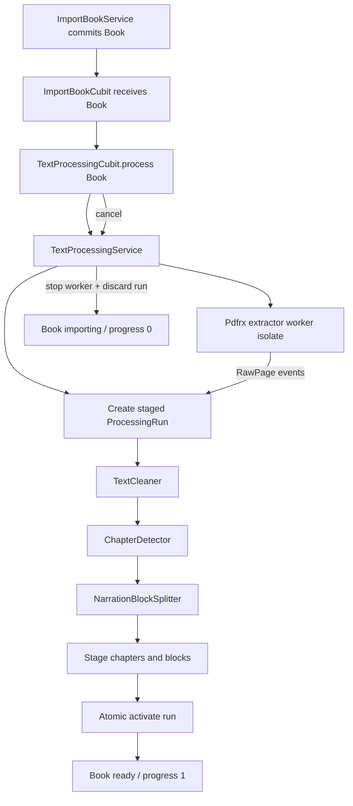

# Text Processing Design

**Spec**: `.specs/features/text_processing/spec.md`
**Status**: Approved

---

## Architecture Overview

Use `pdfrx` as the application PDF dependency and isolate it behind a
`PdfTextExtractor` domain contract. A dedicated processing coordinator owns one
run at a time, streams per-page extraction events from a spawned isolate, stages
all persistence under a run ID, executes deterministic pure-Dart cleaning,
chapter detection, and block splitting, then activates the complete dataset in
one Drift transaction.

The chosen approach deliberately separates:

- native PDF parsing (`PdfrxPdfTextExtractor`);
- deterministic text rules (pure domain services);
- run lifecycle and cancellation (`TextProcessingService`);
- staged/active persistence (`TextProcessingRepository`);
- UI state (`TextProcessingCubit`).

The first implementation task is a vertical technical spike that must prove
Android compilation, exact per-page extraction, worker-isolate execution,
disposal, protected/corrupt failure handling, and cancellation. Failure of that
gate stops the feature before schema or UI work depends on `pdfrx`.



### Processing sequence and progress

| Pipeline segment | Persisted stage | Overall progress | Unit boundary |
| ---------------- | --------------- | ---------------- | ------------- |
| Extraction | `extracting` / `Extraindo texto` | `0.00–0.40` | Each PDF page |
| Cleaning | `cleaning` / `Limpando` | `0.40–0.60` | Each raw page |
| Chapter detection | `detectingChapters` / `Detectando capítulos` | `0.60–0.75` | Each cleaned page/heading |
| Block generation | `buildingBlocks` / `Preparando narração` | `0.75–0.95` | Each paragraph/block |
| Activation | `completing` then `completed` / `Concluído` | `0.95–1.00` | One Drift transaction |

Progress is calculated from completed units and clamped to the current segment.
The repository accepts only `max(current, candidate)`, so duplicate or delayed
events cannot decrease the persisted value.

---

## Selected Approach

### Choice

Add the Flutter `pdfrx` package, use its engine-level `PdfDocument.openFile` and
per-page `PdfPage.loadText` APIs inside a spawned isolate, and keep the rest of
the application dependent only on `PdfTextExtractor`.

### Why

- It exposes selectable text per page, which is the source unit required by the spec.
- It supports Android and the future application platforms.
- It is MIT-licensed and can also supply the Milestone 3 PDF viewer.
- The engine API is independent from Flutter widgets, so native handles can be
  created, consumed, and disposed entirely inside the worker isolate.

### Rejected alternatives

| Alternative | Reason not selected |
| ----------- | ------------------- |
| Syncfusion Flutter PDF | Capable and mature, but introduces a commercial ecosystem and does not provide the same clear reuse path for the planned PDF viewer. |
| `pdf_text_extract` | Mobile-only, very low adoption, unverified publisher, and substantially greater maintenance risk. |
| Custom Android PDFBox platform channel | Maximum control but Android-specific and too much native/plugin surface for the MVP. |

---

## Code Reuse Analysis

### Existing Components to Leverage

| Component | Location | How to Use |
| --------- | -------- | ---------- |
| Feature-first architecture | `lib/features/**` | Add `pdf_processing` data/domain/presentation sublayers only where required. |
| Drift composition | `lib/core/database/app_database.dart` | Register new feature-owned tables and add a version-3 migration. |
| `Book`, status, and progress | `lib/features/library/domain/entities/book.dart` | Extend with page/chapter/block counts and processing stage while preserving existing metadata behavior. |
| `BookRepository` | `lib/features/library/domain/repositories/book_repository.dart` | Add precise processing lifecycle updates; library observation remains the UI refresh source. |
| Import orchestration | `lib/features/import_book/domain/services/import_book_service.dart` | Continue returning the committed `Book`; the presentation boundary starts processing from that result. |
| Cubit conventions | `lib/features/import_book/presentation/cubit/**` | Use guarded methods, exact immutable states, constructor injection, and close-time cancellation. |
| GetIt composition root | `lib/app/dependency_injection/configure_dependencies.dart` | Register extractor, repository, services, and Cubit without service location inside features. |
| Library book widgets/page | `lib/features/library/presentation/**` | Extend status rendering with exact stage, percentage, and cancel action. |
| Injected clock and UUID | `configureDependencies` seams | Generate run/content IDs and deterministic timestamps in tests. |

### Integration Points

| System | Integration Method |
| ------ | ------------------ |
| Import completion | `ImportBookCubit` receives the returned `Book`, then awaits `TextProcessingCubit.process(book.id)` so automatic processing and cancellation share one visible lifecycle. |
| Library observation | Processing writes update `Books`; existing `LibraryCubit.watchAll()` refreshes the exact book item. |
| Deletion | Foreign-key cascades remove processing runs, raw pages, chapters, and blocks in the same database transaction as the book row. |
| Duplicate replacement | Import invalidates the previous active content run only after its PDF replacement is durable; the new processing run replaces derived data atomically when ready. |
| Application shutdown | GetIt disposal closes the processing Cubit/service, cancels the worker, and discards an uncommitted run. |

---

## Components

### PDF text extractor contract

- **Purpose**: Stream exact page text without exposing `pdfrx` types.
- **Location**: `lib/features/pdf_processing/domain/services/pdf_text_extractor.dart`
- **Interfaces**:
  - `Stream<PdfExtractionEvent> extract(PdfExtractionRequest request)` — emits opened/page/completed or typed failure events in page order.
  - `Future<void> cancel(String runId)` — terminates the matching worker and closes ports/resources.
- **Dependencies**: None in the domain.
- **Reuses**: Existing typed-service and constructor-injection style.

`PdfExtractionEvent` variants contain sendable values only: run ID, one-based
page number, page count, exact text, or sanitized failure category. No native
document/page handle crosses an isolate boundary.

### pdfrx extractor adapter

- **Purpose**: Own PDFium initialization, document open, page text loading, and disposal inside a worker isolate.
- **Location**: `lib/features/pdf_processing/data/services/pdfrx_pdf_text_extractor.dart`
- **Interfaces**: Implements `PdfTextExtractor`.
- **Dependencies**: `pdfrx`, `dart:isolate`.
- **Reuses**: `LocalBookFileStorage`'s owned PDF path.

The adapter keeps one `Isolate` and receive port per active run. Cancellation
kills that isolate and closes the receive port. The document is disposed in a
worker-side `finally` block on normal/error completion; cancellation also relies
on isolate teardown to release native resources. The coordinator serializes
production runs globally because PDFium concurrency guarantees are not assumed.

### Text cleaner

- **Purpose**: Apply only the exact deterministic cleaning rules from TXT-02.
- **Location**: `lib/features/pdf_processing/domain/services/text_cleaner.dart`
- **Interfaces**:
  - `HeaderFooterProfile profile(Iterable<RawPageEdge> pages)` — counts normalized first/last non-empty lines.
  - `CleanPage clean(RawPage page, HeaderFooterProfile profile)` — returns cleaned page text without mutating raw input.
- **Dependencies**: None.
- **Reuses**: None; pure Dart domain logic.

Cleaning is two-pass but incremental: the first pass streams only page number and
edge-line summaries; the second reads one staged raw page at a time, applies the
profile, and writes staged cleaned output. It never loads the full PDF byte array
or all page texts into the UI isolate.

### Chapter detector

- **Purpose**: Convert ordered cleaned pages into chapter drafts.
- **Location**: `lib/features/pdf_processing/domain/services/chapter_detector.dart`
- **Interfaces**:
  - `ChapterDetectionState addPage(CleanPage page)` — consumes lines in source order.
  - `List<ChapterDraft> finish(String fallbackTitle)` — closes the current chapter or emits the one-chapter fallback.
- **Dependencies**: Injected ID generator.
- **Reuses**: Exact title patterns from the product specification.

Heading patterns are anchored to the complete trimmed line. `N` is one or more
decimal digits for Portuguese/English/Volume and for `第N章`. Matching is
case-insensitive where the script supports case.

### Narration block splitter

- **Purpose**: Split chapter paragraphs without loss into at-most-3,000-character blocks.
- **Location**: `lib/features/pdf_processing/domain/services/narration_block_splitter.dart`
- **Interfaces**:
  - `Iterable<NarrationBlockDraft> split(ChapterDraft chapter)` — emits ordered block drafts.
- **Dependencies**: Injected ID generator.
- **Reuses**: Chapter source/page mapping.

Sentence candidates end after `.`, `!`, `?`, `。`, `！`, or `？`. Splitting
removes only boundary whitespace introduced by paragraph separation; reconstruction
uses each block's exact `originalText` in order.

### Text processing repository

- **Purpose**: Stage page/content data, publish progress, atomically activate a complete dataset, and discard failures.
- **Location**:
  - contract: `lib/features/pdf_processing/domain/repositories/text_processing_repository.dart`
  - Drift implementation: `lib/features/pdf_processing/data/repositories/drift_text_processing_repository.dart`
- **Interfaces**:
  - `createRun(bookId, runId, startedAt)`
  - `stageRawPage(runId, RawPage)`
  - `streamRawPageEdges(runId)` / `streamRawPages(runId)`
  - `stageCleanPage(runId, CleanPage)`
  - `stageChaptersAndBlocks(runId, chapters, blocks)`
  - `updateProgress(bookId, stage, progress, updatedAt)`
  - `activateRun(runId, counts, completedAt)`
  - `discardRun(runId, terminalStatus, updatedAt)`
- **Dependencies**: `AppDatabase`.
- **Reuses**: Drift transaction and repository patterns.

All staging rows carry `runId`. Read APIs for future reader/narration features
resolve only the book's `activeContentRunId`; therefore staged or abandoned
content is never visible. `activateRun` updates the active run, counts, status,
stage, and progress and removes the superseded run in one transaction.

### Text processing service

- **Purpose**: Enforce the pipeline, progress ranges, cancellation, rollback, and one-run invariant.
- **Location**: `lib/features/pdf_processing/domain/services/text_processing_service.dart`
- **Interfaces**:
  - `Future<ProcessingResult> process(String bookId)`
  - `Future<ProcessingResult> cancel(String bookId)`
  - `Future<void> close()`
- **Dependencies**: `BookRepository`, `TextProcessingRepository`,
  `PdfTextExtractor`, cleaner, detector, splitter, clock, and ID generators.
- **Reuses**: Existing application-owned PDF path and status model.

The service checks cancellation between every page/pipeline unit. Typed outcomes
are `completed`, `cancelled`, `unsupported`, and `failed`. It converts parser
errors to sanitized outcomes and never logs page/content payloads.

### Text processing Cubit

- **Purpose**: Guard user requests and expose exact messages/cancel availability.
- **Location**:
  - `lib/features/pdf_processing/presentation/cubit/text_processing_cubit.dart`
  - `lib/features/pdf_processing/presentation/cubit/text_processing_state.dart`
- **Interfaces**:
  - `process(String bookId)`
  - `cancel(String bookId)`
  - `clearMessage()`
- **Dependencies**: `TextProcessingService`.
- **Reuses**: Existing Cubit lifecycle and state equality conventions.

The durable stage/percentage remains in `Book` and flows through `LibraryCubit`.
The processing Cubit holds only active book ID, cancel-in-flight state, and the
exact transient success/error message.

### Library processing presentation

- **Purpose**: Display exact per-book stage/progress and an accessible cancel action.
- **Location**: Existing library list/grid items and page.
- **Interfaces**: New optional `onCancelProcessing(Book)` callback.
- **Dependencies**: `TextProcessingCubit`.
- **Reuses**: Existing list/grid parity, semantics, and Snackbar handling.

Both item variants show stage text and a determinate percent for `processing`;
the page delegates cancellation to the exact book ID. Import remains disabled
while selection/copying/processing from the same import request is active.

---

## Data Models

### Book additions

```text
pageCount: int              default 0
chapterCount: int           default 0
blockCount: int             default 0
processingStage: enum?      nullable outside active/completed processing
activeContentRunId: String? nullable until first successful processing
```

`BookStatus` remains `importing | processing | ready | failed | unsupported`.

### ProcessingRun

```text
id: String primary key
bookId: String foreign key -> Books.id on delete cascade
cleanText: String nullable until cleaning completes
state: staging | active
startedAt: DateTime
completedAt: DateTime?
```

Only one active run may be referenced by a book. Staging runs are internal and
never returned by content-read repositories.

### RawPage

```text
runId: String foreign key -> ProcessingRuns.id on delete cascade
pageNumber: int one-based
rawText: String
cleanText: String?
primary key: (runId, pageNumber)
```

An empty page is retained with an empty `rawText`. `rawText` is never updated.

### Chapter

```text
id: String primary key
runId: String foreign key -> ProcessingRuns.id on delete cascade
bookId: String foreign key -> Books.id on delete cascade
title: String
sortOrder: int zero-based
startPage: int
endPage: int
cleanText: String
createdAt: DateTime
updatedAt: DateTime
unique: (runId, sortOrder)
```

### NarrationBlock

```text
id: String primary key
runId: String foreign key -> ProcessingRuns.id on delete cascade
chapterId: String foreign key -> Chapters.id on delete cascade
sortOrder: int zero-based within chapter
originalText: String
normalizedText: String
characterCount: int
startPage: int
endPage: int
unique: (chapterId, sortOrder)
```

`estimatedDuration` is deferred until narration settings define a rate.

### Database migration

`AppDatabase.schemaVersion` moves from 2 to 3. The migration:

1. adds the five nullable/defaulted processing columns to `Books`;
2. creates processing runs, raw pages, chapters, and narration blocks;
3. creates indexes for `bookId`, `runId`, and ordered chapter/block reads;
4. enables and tests cascading deletion;
5. preserves every version-2 book with counts zero, no stage, and no active run.

Generated Drift files are regenerated through the existing `build_runner` flow.

---

## Transaction and Lifecycle Rules

### Successful first processing

1. Set book `processing`, stage `extracting`, progress `0`.
2. Create a staging run.
3. Extract and stage exact raw pages individually.
4. Build and stage clean pages, chapters, and blocks under that run ID.
5. In one transaction: mark run active, set book active run/counts/status
   `ready`/stage `completed`/progress `1`.

### Cancellation or failure

1. Signal/kill the worker if extraction is active.
2. Delete the staging run; cascades remove its pages/chapters/blocks.
3. For cancellation, set book `importing`, null stage, progress `0`.
4. For no text, set `unsupported`; otherwise set `failed`; both use null stage
   and progress `0`.
5. If a prior active run exists, retain it until a later successful activation;
   status still reports the current retry outcome.

### Reprocessing/idempotency

A new run always receives a new run ID. It never mutates the active run.
Activation swaps `activeContentRunId` and removes the superseded run in the same
transaction. Retry therefore produces one visible raw/chapter/block dataset.

### Deletion

`LibraryService.deleteBook` continues quarantining files first. Repository
deletion becomes a transaction whose database foreign-key cascades remove all
text-processing rows. If file cleanup fails and the book row is restored, the
complete active derived dataset must also be restored; therefore deletion
compensation changes from reinserting only `Book` to snapshotting/restoring the
book plus its active processing run. This behavior receives an explicit
integration test before the existing deletion guarantee is considered preserved.

---

## Error Handling Strategy

| Error Scenario | Handling | User Impact |
| -------------- | -------- | ----------- |
| Zero non-whitespace extracted text | Discard staging run; set `unsupported` | `Este PDF não possui texto extraível` |
| Corrupt, protected, or parser failure | Dispose worker resources, discard staging, set `failed` | `Não foi possível processar este PDF` |
| Database/staging/final commit failure | Transaction rollback; discard new run; retain previous active run | `Não foi possível processar este PDF` |
| User cancellation | Kill worker, discard staging, restore `importing` | `Processamento cancelado` |
| Duplicate process request | Return/join existing in-flight future | No second worker or duplicate data |
| Late cancellation after activation | Ignore cancellation | Completed `ready` data remains |
| App/service disposal mid-run | Cancel worker and discard staging before close completes | Imported PDF remains retryable |

---

## Risks & Concerns

| Concern | Location (file:line) | Impact | Mitigation |
| ------- | -------------------- | ------ | ---------- |
| `pdfrx` isolate/native-assets behavior has not been proven in this application. | New adapter; `pubspec.yaml` | Android build or worker extraction could fail after downstream work. | Make the adapter/Android/isolate proof the first gated task; stop and reassess before schema work if it fails. |
| PDFium native resources and cancellation can leak when a worker is interrupted. | New `pdfrx_pdf_text_extractor.dart` | Memory/handle growth across large libraries. | Worker-side `finally`, explicit document disposal, port closure, repeated cancel/retry resource test. |
| Current import flow ends immediately after copying. | `lib/features/import_book/presentation/cubit/import_book_cubit.dart:13` | Automatic processing is not started and import state cannot expose processing. | Integrate returned `Book` with `TextProcessingCubit` and test the exact full state sequence. |
| Current `Book` lacks counts, stage, and active content identity. | `lib/features/library/domain/entities/book.dart:16` | UI and future reader cannot resolve a complete dataset. | Add version-3 columns with safe defaults and migration coverage. |
| Current deletion compensation restores only the `Book` row. | `lib/features/library/domain/services/library_service.dart:77` | Cascaded derived data could be lost if file cleanup fails after database deletion. | Add content snapshot/restore to repository-backed deletion compensation and a restart test. |
| Header/footer detection needs a document-wide frequency profile. | New cleaner | Loading all page text would violate incremental processing. | Two passes over staged page rows; retain only edge-frequency maps in memory. |
| Existing tests use arbitrary bytes as “PDF” fixtures. | `test/widget_test.dart:92` | Automatic parsing will correctly reject the existing fake fixture. | Replace only processing-path fixtures with a minimal valid selectable-text PDF; retain malformed bytes for failure tests. |
| No explicit foreign-key enablement assertion exists. | `lib/core/database/app_database.dart` | Cascade behavior may differ across executors. | Enable foreign keys in `beforeOpen` and test fresh, migration, and deletion behavior on the production-style executor. |

---

## Tech Decisions

| Decision | Choice | Rationale |
| -------- | ------ | --------- |
| PDF stack | `pdfrx` with engine API behind an adapter | Per-page text today and viewer reuse in Milestone 3. |
| Background model | Dedicated spawned isolate with sendable event protocol | Keeps native work off UI isolate and enables hard cancellation. |
| Processing concurrency | One production processing run globally; duplicate book calls join | Avoids unverified PDFium concurrency and bounds resource use. |
| Persistence publication | Run-scoped staging plus atomic active-run swap | Meets no-partial-results, retry, and prior-dataset preservation rules. |
| Cleaning memory model | Two streaming passes over staged pages | Supports header/footer frequency without loading whole books. |
| UI source of truth | Durable stage/progress on `Book`; Cubit only coordinates actions/messages | Existing library stream remains authoritative across restart. |

The `pdfrx` choice is feature-local until proven by the technical spike. If the
spike passes, it should be recorded as a project-level PDF-stack decision because
Milestone 3 will reuse it.
