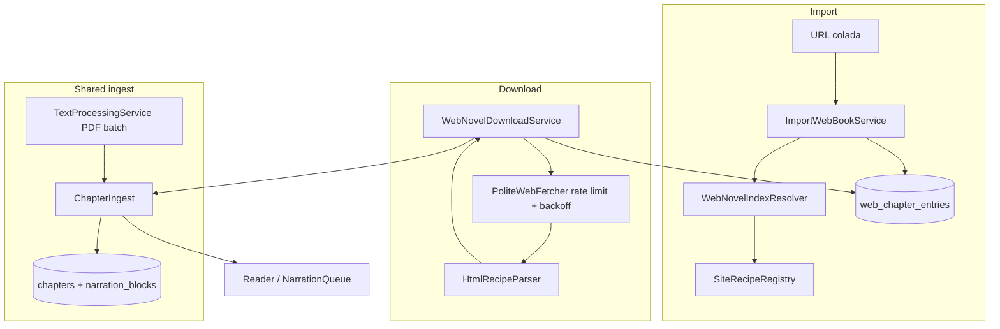

# Web Source Import Design

**Spec**: `.specs/features/web_source_import/spec.md`
**Status**: Draft

---

## Architecture Overview

The processing pipeline today is **batch**: `TextProcessingService` stages every
raw page, cleans them, detects chapters over the whole document, then commits
chapters and blocks in a single `stageChaptersAndBlocks` call and activates the
run. The book becomes readable only at `activateRun`.

A web novel is already segmented by the source, so it does not need — and cannot
afford — that whole-document barrier. The design splits the pipeline along the
shape of the source:

- **Paged source** (PDF): needs the full document before chapters exist → batch.
- **Chaptered source** (web): each chapter is self-sufficient → incremental.

Both drive the same **`ChapterIngest`** collaborator, which owns the one part
that must never diverge: clean chapter text → narration blocks → persisted
chapters and blocks.



`ImportWebBookService` resolves the index and persists it, then hands off to
`WebNovelDownloadService`, which drains the queue chapter by chapter. Each stored
chapter goes straight through `ChapterIngest`, so it is narratable the moment it
lands.

---

## Code Reuse Analysis

### Existing Components to Leverage

| Component | Location | How to Use |
| --- | --- | --- |
| `NarrationBlockSplitter` | `lib/features/pdf_processing/domain/services/narration_block_splitter.dart` | Reuse unchanged inside `ChapterIngest` |
| `TextCleaner` | `lib/features/pdf_processing/domain/services/text_cleaner.dart` | Reuse for web chapters with an empty/neutral profile |
| `stageChaptersAndBlocks` | `drift_text_processing_repository.dart:90` | Already `insertAll` (append-only) — safe to call once per chapter |
| `ProcessingRuns` / `Chapters` / `NarrationBlocks` | `lib/features/pdf_processing/data/database/` | Web chapters reuse the same tables and the same active-run pointer |
| `NarrationQueue`, narration cubit, player bar | `lib/features/narration/` | Unchanged except for the download-boundary outcome |
| `VisualReaderRepository` / `TextReaderView` | `lib/features/visual_reader/` | Unchanged; web books simply never open `OriginalPdfView` |
| `ImportBookCubit` pattern | `lib/features/import_book/presentation/cubit/` | Mirror its state/cubit shape for `ImportWebBookCubit` |
| Hand-written fake collaborators in tests | `test/features/**` | Same convention — no mocking package; fake `WebFetcher` + HTML fixture |

### Integration Points

| System | Integration Method |
| --- | --- |
| `Books` table | New `sourceType` / `sourceRef` columns; file columns become nullable |
| Active content run | Web run is activated at the **first** stored chapter, then its counts are updated as chapters land |
| Library UI | New "Importar da web" entry; web books openable while `processing` |
| Narration | New boundary outcome when the queue ends with chapters still pending |
| DI composition root | `configure_dependencies.dart` registers the web feature's services |

---

## Components

### `ChapterIngest` (shared)

- **Purpose**: Turn clean chapter text into persisted chapters and narration blocks — the single ingest path for every source.
- **Location**: `lib/features/content_ingestion/domain/services/chapter_ingest.dart`
- **Interfaces**:

```dart
final class IngestedChapters {
  const IngestedChapters({required this.chapterCount, required this.blockCount});
  final int chapterCount;
  final int blockCount;
}

final class ChapterIngest {
  ChapterIngest({
    required TextProcessingRepository processing,
    required ProcessingIdGenerator chapterId,
    required ProcessingIdGenerator blockId,
  });

  Future<IngestedChapters> ingest({
    required String runId,
    required String bookId,
    required List<DetectedChapter> chapters,
    required DateTime createdAt,
  });
}
```

- **Dependencies**: `TextProcessingRepository`, id generators.
- **Reuses**: `NarrationBlockSplitter`; the exact draft-building block currently inlined at `text_processing_service.dart:224-300`, extracted verbatim.

### `WebNovelDownloadService`

- **Purpose**: Own the resumable, throttled chapter queue and drive `ChapterIngest` per chapter.
- **Location**: `lib/features/web_source/domain/services/web_novel_download_service.dart`
- **Interfaces**:

```dart
enum WebDownloadOutcome { completed, cancelled, paused, unsupported, failed }

final class WebNovelDownloadService {
  Future<WebDownloadOutcome> download(String bookId);   // resumes from first non-stored entry
  Future<WebDownloadOutcome> retryFailed(String bookId);
  Future<int> fetchNewChapters(String bookId);          // returns count appended
  Future<void> cancel(String bookId);
  Stream<WebDownloadProgress> watch(String bookId);
}
```

- **Dependencies**: `WebSourceRepository`, `WebChapterFetcher`, `ChapterIngest`, `TextProcessingRepository` (progress/status), `BookRepository`, clock.
- **Reuses**: cancellation-token and per-book run-map pattern from `TextProcessingService`; **does not** take that service's static `_globalTail` lock (see Risks).

### `WebChapterFetcher`

- **Purpose**: Fetch one chapter URL and extract its title and body text per the domain recipe.
- **Location**: `lib/features/web_source/domain/services/web_chapter_fetcher.dart` (interface) + `data/services/html_recipe_parser.dart`
- **Interfaces**:

```dart
sealed class ChapterFetchResult {}
final class ChapterFetched extends ChapterFetchResult {
  ChapterFetched({required this.title, required this.text});
  final String title;
  final String text;
}
final class ChapterFetchFailed extends ChapterFetchResult {
  ChapterFetchFailed(this.kind, this.message);
  final ChapterFailureKind kind;   // network, http, notFound, extraction, offDomain
  final String message;
}

abstract interface class WebChapterFetcher {
  Future<ChapterFetchResult> fetch(Uri url, SiteRecipe recipe);
}
```

- **Reuses**: `package:html` parsing; recipe selectors.

### `PoliteWebFetcher`

- **Purpose**: The only component that touches the network — enforces politeness so no caller can bypass it.
- **Location**: `lib/features/web_source/data/services/polite_web_fetcher.dart`
- **Behavior**: ≥1s spacing per host; honors `Retry-After` on `429`/`503`; descriptive app `User-Agent`; abandons redirects that leave the recipe's host; bounded retries with exponential backoff (attempts 1s → 2s → 4s, max 4 attempts).
- **Dependencies**: `package:http` `1.6.0` behind an interface so tests inject a fake.

### `WebNovelIndexResolver`

- **Purpose**: Normalize any supported URL to its series URL and produce the ordered chapter index.
- **Location**: `lib/features/web_source/domain/services/web_novel_index_resolver.dart`
- **Interfaces**:

```dart
final class WebNovelIndex {
  final Uri seriesUrl;
  final String title;
  final List<WebChapterRef> chapters;   // url, title, sortOrder — deduplicated by url
}

abstract interface class WebNovelIndexResolver {
  Future<WebNovelIndex> resolve(Uri submitted);
}
```

- **Behavior**: For a chapter URL, follows the recipe's `seriesLinkSelector` (breadcrumb) to reach the series page. Deduplicates repeated links, preserving first occurrence order.

### `SiteRecipeRegistry`

- **Purpose**: Load and validate per-domain recipes; reject a recipe missing a required field, naming the field.
- **Location**: `lib/features/web_source/domain/services/site_recipe_registry.dart`, data from `assets/site_recipes.json`
- **Shipped recipe** (`centralnovel.com`, every selector verified against the live series and chapter pages):

```json
{
  "domain": "centralnovel.com",
  "seriesPathPrefix": "/series/",
  "seriesLinkSelector": "a[itemprop=item][href*='/series/']",
  "chapterIndexSelector": "div.eplister li > a",
  "chapterIndexTitleSelector": "div.epl-title",
  "chapterIndexOrder": "descending",
  "chapterTitleSelector": "h1.entry-title",
  "contentSelector": "div.epcontent.entry-content",
  "paragraphSelector": "p",
  "nextChapterSelector": "a[rel=next]",
  "disallowedPathPatterns": ["/pdf/", "/search/", "/?s="],
  "minimumChapterCharacters": 200
}
```

Two verified details the selectors depend on:

- **`li > a` must be a direct-child selector.** Each `<li>` holds the chapter
  anchor as a direct child *and* a sibling `div.epl-pdf > a.dlpdf` pointing at
  the `/pdf/` path that `robots.txt` disallows. A descendant selector (`li a`)
  would harvest 1437 disallowed URLs into the queue.
- **The index is listed newest-first**, so `chapterIndexOrder: "descending"`
  drives a reversal before `sortOrder` is assigned. The oldest entry also carries
  a variant class (`li.tseplsfrst`), which `li > a` matches but an attribute-order
  -sensitive match would drop — silently losing chapter 1.

Reference measurement (2026-08-17): the series page yields 1437 chapter URLs,
matching its 1437 `/pdf/` siblings — a useful invariant for the recipe test.

### `WebSourceRepository`

- **Purpose**: Persist and query the chapter index/queue.
- **Location**: `lib/features/web_source/domain/repositories/web_source_repository.dart` + `data/repositories/drift_web_source_repository.dart`
- **Interfaces**:

```dart
abstract interface class WebSourceRepository {
  Future<void> replaceIndex(String bookId, List<WebChapterRef> chapters);
  Future<List<WebChapterEntry>> pending(String bookId);      // ordered by sortOrder
  Future<List<WebChapterEntry>> failed(String bookId);
  Future<WebChapterCounts> counts(String bookId);            // total / stored / failed
  Future<Set<String>> knownUrls(String bookId);
  Future<int> appendNew(String bookId, List<WebChapterRef> chapters);
  Future<void> markStored(String bookId, int sortOrder, DateTime at);
  Future<void> markFailed(String bookId, int sortOrder, String reason, DateTime at);
}
```

### `ImportWebBookService` + `ImportWebBookCubit`

- **Purpose**: Validate the URL, resolve the index, create or resolve the book, persist the index, and start the download.
- **Location**: `lib/features/web_source/domain/services/import_web_book_service.dart`, `presentation/cubit/`
- **Validation order**: absolute `http`/`https` → known domain → path not disallowed → resolvable index → non-empty index.
- **Reuses**: `ImportBookCubit`'s state shape and the library page's import affordance.

---

## Data Models

### Schema version 5 → 6

```dart
// Books: new columns
TextColumn get sourceType => text().withDefault(const Constant('pdf'))();
TextColumn get sourceRef  => text().nullable()();   // canonical series URL for web

// Books: these become nullable (web books have no local file)
TextColumn get originalFileName => text().nullable()();
TextColumn get storedFilePath   => text().nullable()();
TextColumn get fileHash         => text().nullable()();
```

```dart
@TableIndex(name: 'web_chapter_entries_book_order_unique',
            columns: {#bookId, #sortOrder}, unique: true)
@TableIndex(name: 'web_chapter_entries_book_url_unique',
            columns: {#bookId, #url}, unique: true)
class WebChapterEntries extends Table {
  TextColumn get bookId => text().references(Books, #id, onDelete: KeyAction.cascade)();
  IntColumn  get sortOrder => integer()();
  TextColumn get url => text()();
  TextColumn get title => text()();
  TextColumn get state => text()();          // pending | stored | failed
  IntColumn  get attemptCount => integer().withDefault(const Constant(0))();
  TextColumn get lastError => text().nullable()();
  IntColumn  get updatedAt => integer().map(const UtcDateTimeConverter())();

  @override
  Set<Column<Object>> get primaryKey => {bookId, sortOrder};
}
```

Plus a unique index `books_source_ref_unique` on `sourceRef` (SQLite permits many
`NULL`s in a unique index, so PDF books are unaffected — the same property makes
the existing `books_file_hash_unique` safe once `fileHash` is nullable).

**Migration note**: SQLite cannot drop `NOT NULL` with `ALTER TABLE`. Dropping it
on the three file columns requires Drift's `TableMigration` (recreate + copy),
which is a heavier step than every prior migration in this project.

### Ordinal mapping

`Chapters.startPage`/`endPage` and `NarrationBlocks.startPage`/`endPage` are
non-nullable. For web chapters both bounds carry the chapter's **ordinal
position** in the index, keeping ordering and position-resume semantics intact
without a schema change to those tables.

### New processing stage

`ProcessingStage` gains `downloading('Baixando capítulos', 0, 1)`. The enum
persists by `name`, so adding a value does not affect existing rows.

---

## Error Handling Strategy

| Error Scenario | Handling | User Impact |
| --- | --- | --- |
| Invalid / non-absolute URL | Rejected before any request | "Informe uma URL válida" — no book created |
| Domain without recipe | Rejected at registry lookup | "Site não suportado: {domínio}" |
| Disallowed path (`/pdf/`, `/search/`, `/?s=`) | Rejected at validation | "Este endereço não é permitido pelo site" |
| Network failure during import | Import fails atomically | No partial book left behind |
| Network failure mid-queue | Queue pauses, stored chapters retained | Book stays readable; retry resumes |
| `429` / `503` with `Retry-After` | Wait the stated duration, then continue | Slower progress, no failure |
| Transient chapter error | Backoff retry up to 4 attempts | Invisible unless all attempts fail |
| Chapter `404` / persistent failure | Entry marked `failed`, queue continues | "N capítulos falharam" + retry action |
| Extraction below `minimumChapterCharacters` | Treated as extraction failure, nothing stored | Same as above — never a stub chapter |
| Every chapter fails extraction | Book marked `unsupported` | "O layout do site não foi reconhecido" |
| Redirect leaving the recipe host | Request abandoned | Counted as a chapter failure |
| Empty series index | Import marked unsupported | "Nenhum capítulo encontrado" |

---

## Risks & Concerns

| Concern | Location | Impact | Mitigation |
| --- | --- | --- | --- |
| Static `_globalTail` serializes **all** processing across books | `text_processing_service.dart:107` | A ~1400-chapter download at ≥1s/chapter (~25 min) would block every PDF import for its whole duration | The web service uses a per-book lock only and never enters the global tail; a task asserts a PDF import proceeds while a web download runs |
| `activateRun` derives run `cleanText` from `raw_pages` | `drift_text_processing_repository.dart:181-186` | Web runs have no raw pages → run `cleanText` is empty | No consumer of `ProcessingRuns.cleanText` exists outside this write; per-chapter text lives in `Chapters.cleanText`. A task confirms no reader depends on it before relying on this |
| `activateRun` is one-shot and sets `completedAt` + final counts | `drift_text_processing_repository.dart:166` | Incremental activation needs "active but still growing" | New repository methods `activatePartialRun` (first chapter) and `updateRunCounts` (per chapter); `completedAt` set only when the queue drains |
| `NarrationQueue.fromContent` force-unwraps `activeContentRunId!` | `narration_queue.dart:11` | A web book opened before activation would crash narration | The book is only openable after the first chapter activates the run; a test covers open-with-zero-chapters |
| `readActiveContent` orders blocks by `chapterId` (a UUID) then `sortOrder` | `drift_text_processing_repository.dart:260-263` | Chapters appended over time get UUIDs that sort arbitrarily against existing ones; any consumer relying on flat block order would interleave chapters | Blocks must be grouped by chapter via the ordered chapters list, never consumed flat; a test appends a chapter and asserts narration order follows `Chapters.sortOrder` |
| Reader `loadContent` is one-shot | `visual_reader_repository.dart:4` | Chapters arriving during a session stay invisible until reload | On reaching the last loaded block with entries still pending, reload content once; if nothing new, report the download boundary |
| `TextCleaner` heuristics are PDF-tuned (repeated header/footer profiling) | `text_cleaner.dart` | Could discard a legitimate short line in web chapters | Web ingest passes a neutral profile; a test asserts a short standalone line survives web cleaning |
| No HTTP test infrastructure exists in the project | `test/` | Web tests could drift toward real network calls | Network confined to `PoliteWebFetcher` behind an interface; tests use a fake fetcher over a stored HTML fixture, never the live site |
| Index extraction can truncate silently | `assets/site_recipes.json` (recipe selectors) | A selector that misses list-item variants drops chapters with no error — a missing chapter 1 looks like a normal book until read | The recipe test asserts the parsed index count equals the page's `/pdf/`-sibling count and that the first and last ordinals are contiguous with no gaps; a gap fails the import loudly instead of shipping a hole |
| Three file columns lose `NOT NULL` via table recreation | `books.dart:39-41` | Heaviest migration in the project so far; a mistake risks library data | Dedicated migration task with a v5→v6 test that seeds v5 rows and asserts they survive intact |

---

## Tech Decisions

| Decision | Choice | Rationale |
| --- | --- | --- |
| HTTP client | `package:http` `1.6.0` behind a `WebFetcher` interface | Minimal, first-party, no interceptor machinery needed; the interface keeps tests offline |
| HTML parsing | `package:html` `0.15.6` with CSS selectors | Standard Dart HTML parser; selectors match the recipe format directly |
| Recipe storage | JSON asset, validated at load | Satisfies WEB-15 (new domain = config entry, not code) |
| Chapter segmentation | Site index authoritative; `ChapterDetector` not run for web | The index is exact; the heuristic could only degrade it |
| Rate limit | ≥1s per host, `Retry-After` honored | Politeness; spec `WEB-09` |
| Ordinal in page columns | Chapter ordinal stored as start/end page | Avoids nullable-page migration across `Chapters` and `NarrationBlocks` |
| Web download concurrency | One book at a time, per-book lock, outside the global processing tail | Prevents a long download from starving PDF imports |

> **Project-level decisions** to append to `.specs/STATE.md`: AD-009 (source-shape
> split with a shared ingest core) and AD-010 (network access confined to a
> single polite-fetcher adapter, per-host throttled, never in domain services).
